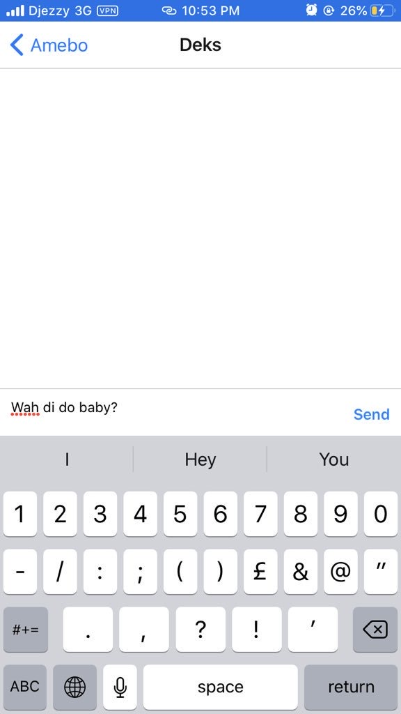

# ChatApp
This is a group chat application called "Amebo" built with React native using Expo CLI, which takes a user's name(s), then creates or joins you to a discussion whereby you communicate with one or more persons, friends or whoever that has this same application as you and is logged in. 

<p align="center"><a href="https://eureka-app.com" target="_blank"> </a></p>

# Usage
Clone or fork this repository then follow these instructions to run the application:

install Node.js from https://nodejs.org/en/download/

If you already have Node.js installed, open your terminal, and run the commands below:

```properties
npm install -g expo-cli
```
```properties
expo init ChatApp
```
```properties
cd ChatApp
```
```properties
npm start # you can also use: expo start
```

Then install the Expo client app on your iOS or Android phone by downloading from your respective app store and connect to the same wireless network as your computer. On Android, use the Expo app to scan the QR code from your terminal to open your project. On iOS, follow on-screen instructions to get a link, so the metro bundler can load and the application can run.

# Components 

This ChatApp was built with React native using basic components like View, StyleSheet, Text etc.

GiftedChat for the message transfers between users. 

Firebase for the database and backend, to keep and track messages.
